  <h2>Hi 👋, I am Aditya</h2>

- 🔭 I’m currently working on cluster lifecycle and infra downstream projects
- 💻 Staff Software Engineer at VMware by Broadcom
- 💬 Ask me about Go, Javascript / Typescript, Kubernetes, cloud infrastructure, observability, infrastructure as code (IaC), DevOps
- 🌱 I’m currently learning Rust
- 📫 How to reach me: <a href="https://www.linkedin.com/in/aditya-bh/">Linkedin</a>
- 😄 Pronouns: he/him
- ⚡ Fun fact: An average person spends 6 years of their life eating

 

  
   
  
  

<!--

<h2>Github stats (external):</h2> 
  

      
       
      
  

**adityabhatia/adityabhatia** is a ✨ _special_ ✨ repository because its `README.md` (this file) appears on your GitHub profile.

Here are some ideas to get you started:
-->

